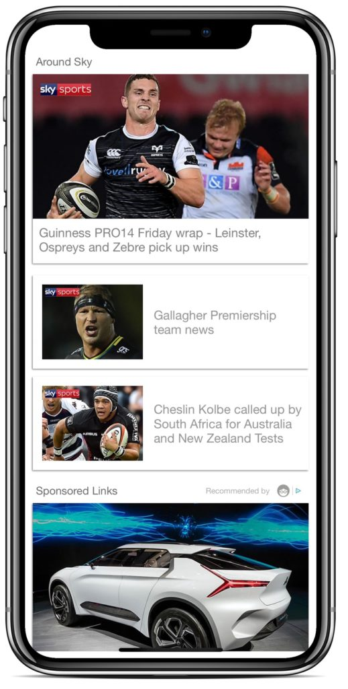

  

---

## Outbrain iOS SDK Framework

About [Outbrain](https://www.outbrain.com/) 

Please make sure to review [Outbrain SDK Developers Site](https://developer.outbrain.com/outbrain-sdk-v3-documentation-download-links/) 

  

## Compatibility and Requirements

| **Outbrain SDK**  	| **Requirements**                                     	|
|--------------------	|------------------------------------------------------	|
| Min OutbrainSDK   	| iOS 9 or higher                                      	|
| Buikd OutbrainSDK   	| iOS 11.2 												|
| Languages          	| Objective-C, Swift                                   	|
| Devices            	| Any iOS compatible device: iPhones, iPads, etc.      	|
| File Sizes         	| Outbrain adds about 100KB to your iOS release app. 	|
| Architectures      	| i386, x86_64, armv7, arm64                                	|

## Installation

### CocoaPods

Just add `pod 'OutbrainSDK'` into your [Podfile](https://guides.cocoapods.org/syntax/podfile.html).

Then run `pod install`.

Follow the [SDK integration steps](https://developer.outbrain.com/ios-sdk-v3-developer-guide/) on our developer site.

Finally add `import OutbrainSDK` in your Swift implementation.

Or `#import <OutbrainSDK/OutbrainSDK.h>` if you're using Objective-C. 